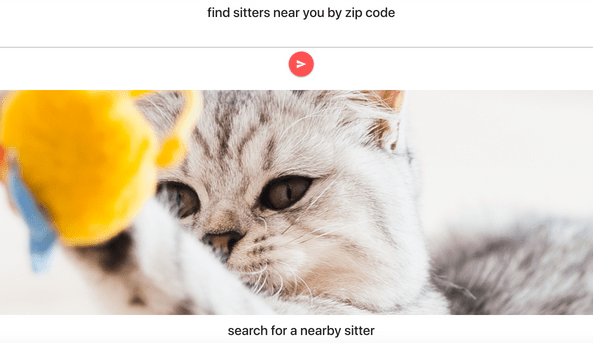
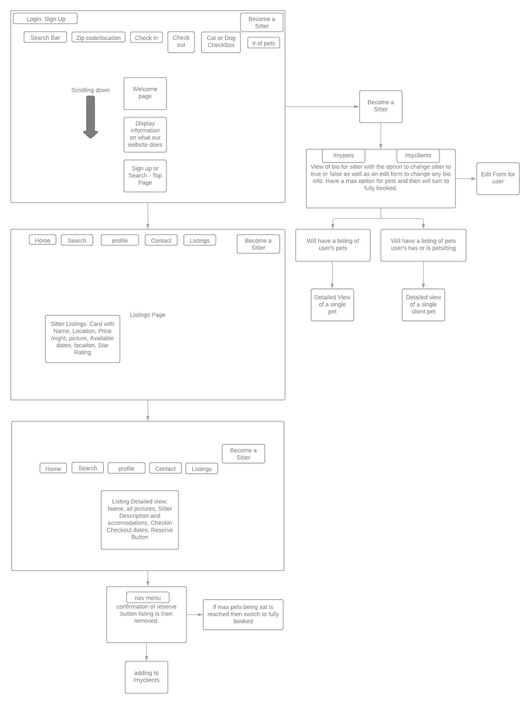
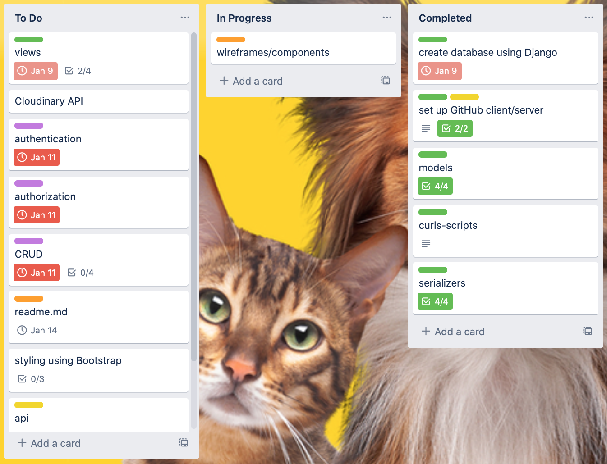
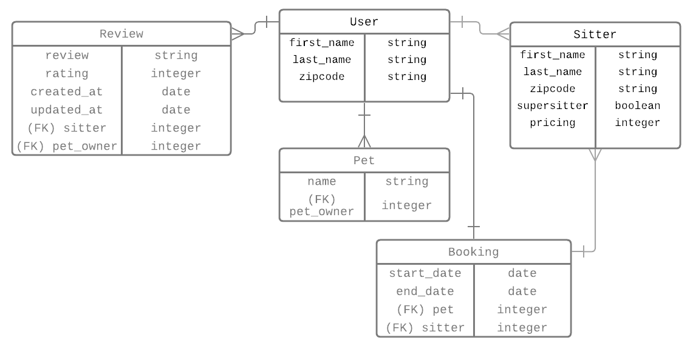

# Pawsibly
### https//pawsibly.herokuapp.com

Finding someone to look after your pet can be challenging. Search for a local pet sitter with this app. <br>
___

___
## Technical Requirements
* Use Django, Flask, or Express
* Create an application using at least 2 related models
* Include all major CRUD functions for at least one of your models
    * At least one PUT
    * At least one DELETE
    * At least one POST
    * At least 2 GETs
* Add authentication and authorization to restrict access to the appropriate users
* Manage team contributions and collaboration using a standard Git flow on GitHub
* Layout and style your front-end with clean and well-formatted CSS, with or without a framework
* Deploy your application online so it's publicly accessible.

## Technologies
---
* React
* Django
* PostgresQL
* Materialize

## Wireframes
---


## Moodboard
---


## Collaboration and Management
---



## User Stories
---
As a user, I want to...<br>
* be able to create an account
* list my pets
* schedule a booking
* leave a review
* rate the service
* have the option to be a sitter

## Routes
___

| Method | Path | Purpose |
| ------ | -------------- | -------------------------------- |
| GET | `/profile` | display profile page |
| GET | `/sitterlisting/id` | display sitter information |
| POST | `/booking` | set up a booking |
| PUT | `/pets/id` | edit a pet |
| DELETE | `/profile` | delete a pet |
| POST | `/booking/id/review` | create a review |

## Entity Relationship Diagram
___



## Installation
---
1. Fork and clone this [repository](https://github.com/kellylarrea/pawsibly-django) then run the following command in your terminal
    * ```python manage.py runserver``` to start the server...
2. Once the server is up and running, fork and clone this repository and run the following commands
    * ```npm install``` to install dependencies
    *  ```npm start``` to launch the app in your browser

